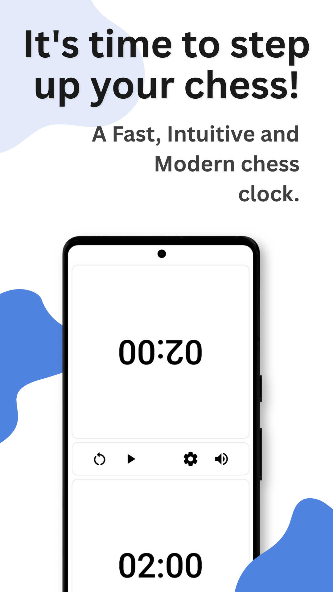
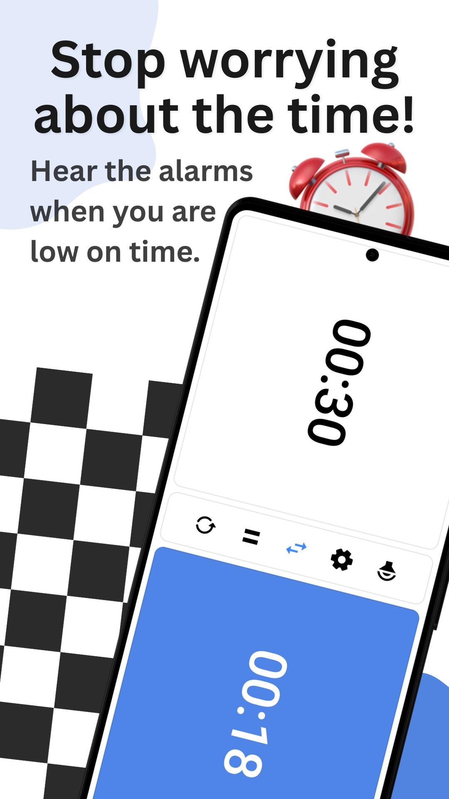
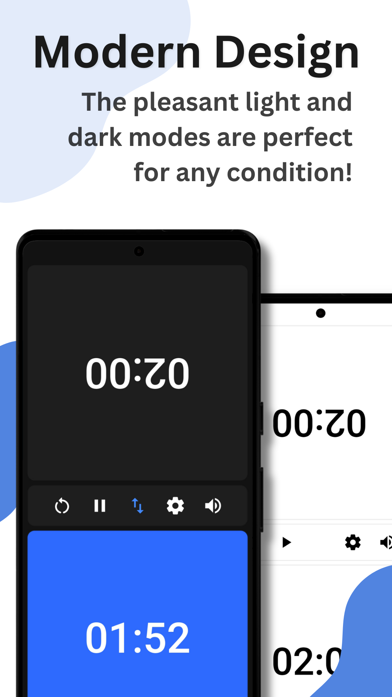
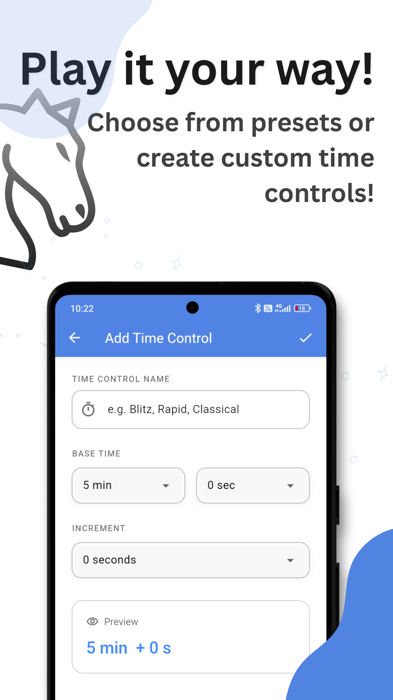

# ClockR Chess Clock

A modern mobile chess clock with many useful features.

## Table of Contents
- [Features](#features)
- [Installation](#installation)
- [Usage](#usage)
- [Contributing](#contributing)
- [License](#license)

## Features
- Modern design
- Customizeable light/dark themes
- Custom time controls
- Alerts for low time remaining
- Multiple languages supported - BG, EN

<div align="start">
  <table>
    <tr>
      <td></td>
      <td></td>
    </tr>
    <tr>
      <td></td>
      <td></td>
    </tr>
  </table>
</div>

## Installation
You have three options to install and try out the app:

### 1. Join the Beta on Google Play
The easiest way to get the app is through the Google Play Store beta program.

👉 Join the Beta Program on Google Play
You'll need to sign in with a Google account and accept the invitation.

### 2. Install the APK from GitHub
Go to the Releases page

Download the latest .apk file

Transfer it to your Android device

Open it and install (you may need to allow unknown sources in your phone's settings)

### 3. Build from Source
Make sure Flutter is installed.

- Clone the repository
git clone https://github.com/gabigoranov/ClockR.git

- Go into the project directory
```cd ClockR```

- Install dependencies
```flutter pub get```

- Run the app
flutter run
To build an APK manually: ```flutter build apk```

You’ll find the APK at ```build/app/outputs/flutter-apk/app-release.apk```.

## Usage

Once installed, open the app and:

- Tap a player's clock to start the game.
- Customize time controls from the settings menu.
- Switch between themes and languages in the app settings.
- Alerts will notify you when time is running low.

Use it for blitz, rapid, or classical games — fully adjustable to your play style.

## Contributing

Contributions are welcome!

If you'd like to suggest a feature, fix a bug, or improve localization:

1. Fork the repository
2. Create a new branch (`git checkout -b feature-name`)
3. Commit your changes (`git commit -m 'Add something'`)
4. Push to the branch (`git push origin feature-name`)
5. Open a Pull Request

Please keep your code clean and follow Flutter/Dart best practices.

## License

This project is licensed under the **CC BY-NC-ND 4.0 International License**.

You are free to download and use the app for personal, non-commercial purposes.

You may not redistribute or modify the code outside of this repository.

Contributions are welcome via pull requests.

See the full license text here: [Creative Commons BY-NC-ND 4.0](https://creativecommons.org/licenses/by-nc-nd/4.0/)


